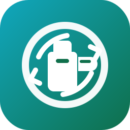

# Dansk Retursystem Pantstation (Home Assistant custom integration)



Home Assistant-ikonet er sat til `custom_components/dansk_retursystem_pantstation/icon.svg` i samme stil som integrationens SVG-billeder.
For kompatibilitet med både Home Assistant og HACS ligger `logo.png` også i komponent-roden.
Der ligger også en `icon.png` fallback i komponent-roden for klienter, der ikke bruger SVG.

Denne integration henter **driftinformation** fra Dansk Retursystems pantstation-sider (fx Randers, Odense) og opretter flere sensorer pr. station i Home Assistant:

- `drift` (Åben/Lukket/Midlertidigt lukket)
- `besked`
- `adresse`
- `åbningstider`

Denne integration henter **driftinformation** fra Dansk Retursystems pantstation-sider (fx Randers, Odense) og opretter flere sensorer pr. station i Home Assistant:

- `drift` (Åben/Lukket/Midlertidigt lukket)
- `besked`
- `adresse`
- `åbningstider`

Alle sensorer indeholder også attributter med `url`, `source` og `last_update`.

## Installation (manuel)

1. Kopiér mappen `custom_components/dansk_retursystem_pantstation/` til din Home Assistant installation under `config/custom_components/`.
2. Genstart Home Assistant.
3. Gå til **Indstillinger → Enheder & tjenester → Tilføj integration**.
4. Vælg **Dansk Retursystem – Pantstation driftinfo**.

## Installation via HACS (valgfri)

Hvis du bruger HACS og repoet er tilføjet som custom repository:

1. Installer integrationen via HACS.
2. Genstart Home Assistant.
3. Tilføj integrationen via UI.

## Konfiguration i UI

Flowet er menu-baseret:

1. Vælg **Tilføj pantstation**.
2. Vælg en pantstation i dropdown-listen.
3. Gentag for flere stationer.
4. Vælg **Færdig** for at oprette integrationen.


## Service

Integrationen registrerer service-kaldet `dansk_retursystem_pantstation.refresh`:

- Uden data: opdaterer alle konfigurerede stationer med det samme.
- Med `url`: opdaterer kun den station, der matcher URL'en.

Eksempel:

```yaml
service: dansk_retursystem_pantstation.refresh
data:
  url: https://danskretursystem.dk/pantstation/randers/
```

## Eksempel-stationer

- Randers: `https://danskretursystem.dk/pantstation/randers/`
- Odense: `https://danskretursystem.dk/pantstation/odense/`

## Tekniske noter

- Polling hvert 5. minut via `DataUpdateCoordinator`.
- Parser HTML med BeautifulSoup4 og tolerant tekstudtræk.
- Hvis driftlinjen ikke kan findes, bliver state `unknown`/`None` og message `None`.
- Alle sensorer eksponerer `entity_picture` via integrationens statiske sti:
  - `/dansk_retursystem_pantstation/img/drift.svg`
  - `/dansk_retursystem_pantstation/img/message.svg`
  - `/dansk_retursystem_pantstation/img/address.svg`
  - `/dansk_retursystem_pantstation/img/opening_hours.svg`
